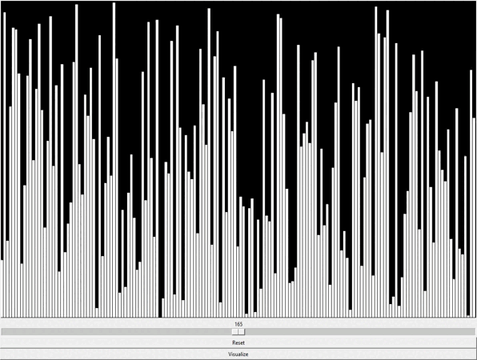

# Sorting Algorithms Visualizer
This is a small project built with python and Tkinter that allows to visualize different sorting algorithms\
Currently it supports these sorting algorithms:
- Bubble Sort
- Selection Sort
- Insertion Sort
- Merge Sort: _**Currently bugged**_
- Quick Sort

I plan to add other sorting algorithms.

### Demonstration with Quick Sort

## Future upgrades
I plan to add a comparison counter and several visual features, as well as more algorithms.\
Another feature I'd like to implement is sound, something like [this video](https://www.youtube.com/watch?v=kPRA0W1kECg) which was a major inspiration for this small project.
